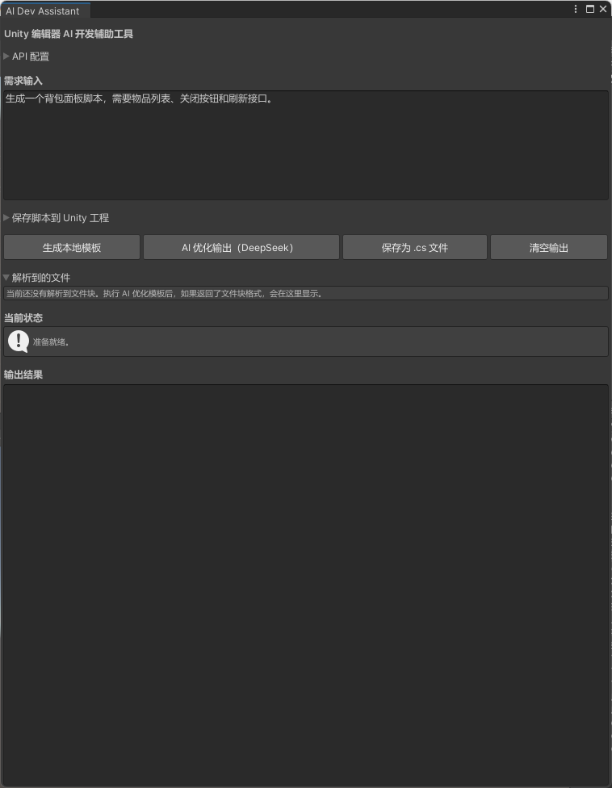

# Unity 编辑器 AI 开发辅助工具

这是一个面向 Unity 客户端开发流程的编辑器工具原型。  
该工具用于根据自然语言需求生成 Unity C# 面板脚本雏形，支持本地模板生成、AI 优化、单文件/多文件解析，以及将生成结果直接保存为 Unity 工程内的 `.cs` 文件。

---

## 项目背景

在 Unity 客户端开发过程中，很多 UI 面板、基础脚本和重复性代码的编写存在较高的机械劳动成本。  
本项目尝试通过“本地模板 + 大模型生成”的方式，构建一个可直接运行在 Unity Editor 中的开发辅助工具，用于提升脚本雏形生成效率，减少重复性编写工作。

本项目的定位不是完整的 AI Agent 平台，而是一个简单的 **Unity 编辑器内 AI 脚本生成辅助工具窗口**。

---

## 工具界面总览

下面是当前工具窗口的整体界面：



---

## 当前已实现功能

### 1. Unity 编辑器窗口工具
- 基于 `EditorWindow` 构建自定义工具窗口
- 使用 IMGUI 编写工具界面
- 支持在 Unity 菜单中直接打开工具

### 2. 本地模板生成
- 根据自然语言需求进行简单关键词识别
- 当前支持：
  - 背包面板 `BagPanel`
  - 商店面板 `ShopPanel`
  - 任务面板 `TaskPanel`
  - 默认通用模板 `DemoPanel`
- 在未接入 AI 时，也可生成基础脚本雏形

### 3. AI 优化生成
- 通过 DeepSeek Chat Completions 接口发送请求
- 将“用户需求 + 本地模板 + 生成规则”拼接成 prompt
- 返回优化后的 Unity C# 代码结果
- 支持连接测试与错误提示
- 工具提供自定义 API 配置，用户可根据自己的 API URL、Model、API Key 接入对应模型服务
- 支持直接根据自然语言需求调用 AI 生成结果

下面是输入需求后的界面示例：


### 4. 单文件 / 多文件解析
- 支持 AI 按统一格式返回代码文件块
- 支持单文件 / 多文件生成
- 当前采用的文件块格式为：

```text
===FILE: ShopPanel.cs===
...代码...

===FILE: ShopGoodsItem.cs===
...代码...
